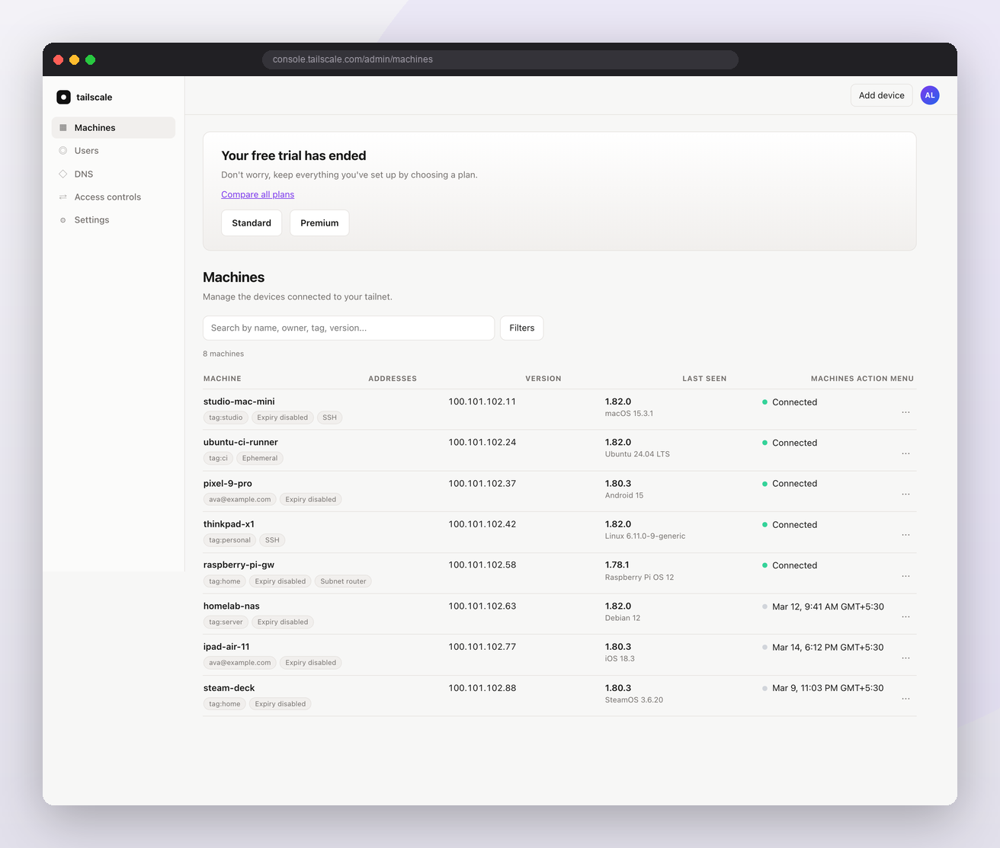
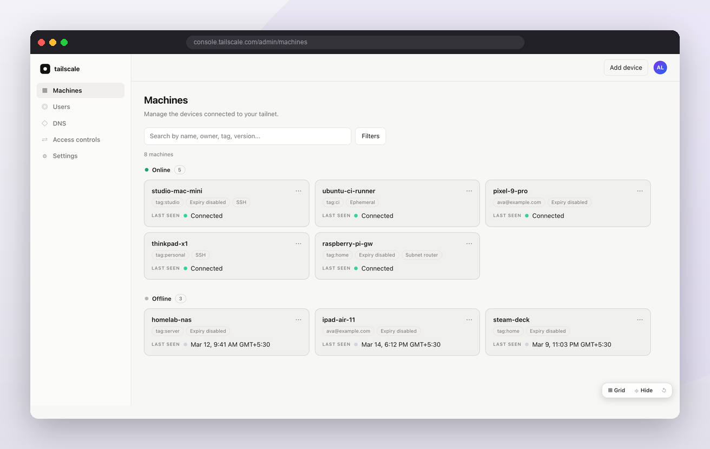

# Tailscale Clean Console

A tiny browser extension that cleans up the Tailscale admin console
(`console.tailscale.com/admin/machines`):

- hides the "Your free trial has ended" banner
- shows the machine list as a card grid, grouped into **Online** / **Offline**
- lets you hide any other element, with one-click reset

| Before | After |
| --- | --- |
|  |  |

## Install

**Chrome / Edge (MV3)** — open `chrome://extensions`, turn on *Developer
mode*, click **Load unpacked**, pick the `chrome/` folder.

**Firefox (MV2)** — open `about:debugging#/runtime/this-firefox`, click
**Load Temporary Add-on…**, pick `firefox/manifest.json`. This lasts until
Firefox restarts; to keep it, sign the folder with
`npx web-ext sign --source-dir firefox --channel unlisted`.

## Usage

A pill sits in the bottom-right of the Machines page:

| Button | Action |
| --- | --- |
| ▦ Grid / ☰ List | toggle card grid ↔ classic table |
| ⌖ Hide | click an element to hide it; click a device to hide that device (Esc cancels) |
| ↺ | show everything you hid |

Hiding a device removes its card and drops it from the **Online / Offline**
totals (the count reflects only the devices still shown). The reset button
brings every hidden device and element back.

The layout, hidden elements and hidden devices are remembered per-site, and
saved automatically on every change in `localStorage` under `tsc:settings:v1`
(`hidden` for picked elements, `hiddenDevices` for whole devices). Nothing else
is stored or sent anywhere — see [PRIVACY.md](PRIVACY.md).

## Layout

```
chrome/   Chrome / Edge extension (Manifest V3)
firefox/  Firefox extension (Manifest V2)
test/     mock Machines page + assertion harness
assets/   store zips, icons, banners and listing copy for both stores
```

Run the tests with `node test/serve.mjs`, then open
<http://localhost:8787/test/harness.html>.

Unofficial project, not affiliated with Tailscale Inc. See
[PRIVACY.md](PRIVACY.md).
